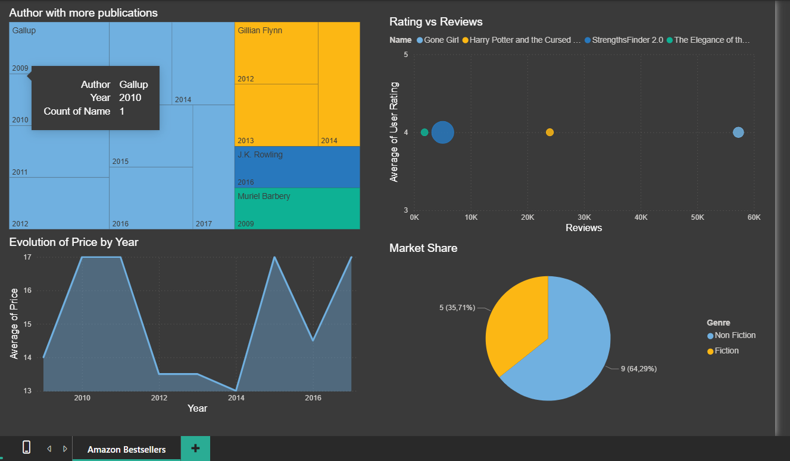

#English Version
# 📚 Amazon Bestsellers Analysis (2009-2019)

## 👤 Project Overview
This project presents an end-to-end data analysis of Amazon's top 50 bestselling books over an 11-year period. As a **Systems Engineer**, I developed this project to demonstrate the integration of relational databases with modern Business Intelligence tools.

## 🛠️ Technical Stack
* **Database:** MySQL Workbench (Data modeling, ETL, and cleaning).
* **Analytics:** SQL (Advanced aggregations, `CASE` statements, and `GROUP_CONCAT`).
* **Visualization:** Power BI (Interactive dashboards and DAX measures).
* **Source:** Kaggle (Amazon Bestselling Books dataset).

## 📸 Dashboard Preview

## 🔍 Business Questions Addressed
I utilized SQL to extract specific insights before visualizing them in Power BI:
1. **Price vs. Satisfaction:** Does a higher price tag guarantee a better user rating?
2. **Genre Strategy:** How do pricing strategies and volatility differ between Fiction and Non-Fiction?
3. **Market Dominance:** Which authors have consistently dominated the list for over 5 years?

## 🚀 Key Findings
* **Market Share:** Non-Fiction titles represent the majority of the list (approx. 57%), showing a stable demand for educational and self-help content.
* **Pricing Volatility:** Using the `STDDEV` function in SQL, I identified that Non-Fiction prices vary significantly more than Fiction titles.
* **The "Gallup" Case:** Identified the Gallup Organization as the most consistent entity, maintaining presence in the Top 50 for nearly a decade with a single product.

## 📂 Project Structure
* `/sql-scripts`: Contains the database dump and the analysis queries.
* `/dashboard`: The `.pbix` file for local exploration.
* `/data`: The raw dataset in CSV format.

---
**Developed by:** Carlos Antonio Bernal Benítez - *Systems Engineer*

#Version en Español
# 📚 Análisis de Bestsellers de Amazon (2009-2019)

## 👤 Descripción del Proyecto
Este proyecto presenta un análisis de datos de extremo a extremo (end-to-end) de los 50 libros más vendidos en Amazon durante un período de 11 años. Como **Ingeniero de Sistemas**, desarrollé este proyecto para demostrar la integración de bases de datos relacionales con herramientas modernas de Business Intelligence (BI).

## 🛠️ Stack Técnico
* **Base de Datos:** MySQL Workbench (Modelado de datos, ETL y limpieza).
* **Análisis:** SQL (Agregaciones avanzadas, sentencias `CASE` y `GROUP_CONCAT`).
* **Visualización:** Power BI (Dashboards interactivos y medidas DAX).
* **Fuente:** Kaggle (Dataset de libros más vendidos de Amazon).

## 📸 Vista Previa del Dashboard

## 🔍 Preguntas de Negocio Abordadas
Utilicé SQL para extraer insights específicos antes de visualizarlos en Power BI:
1. **Precio vs. Satisfacción:** ¿Un precio más alto garantiza una mejor calificación del usuario?
2. **Estrategia por Género:** ¿Cómo difieren las estrategias de precios y la volatilidad entre Ficción y No Ficción?
3. **Dominio del Mercado:** ¿Qué autores han dominado consistentemente la lista por más de 5 años?

## 🚀 Hallazgos Clave
* **Cuota de Mercado:** Los títulos de No Ficción representan la mayoría de la lista (aprox. 57%), mostrando una demanda estable de contenido educativo y de autoayuda.
* **Volatilidad de Precios:** Utilizando la función `STDDEV` en SQL, identifiqué que los precios de No Ficción varían significativamente más que los de Ficción.
* **El Caso "Gallup":** Se identificó a la organización Gallup como la entidad más consistente, manteniendo su presencia en el Top 50 durante casi una década con un solo producto.

## 📂 Estructura del Proyecto
* `/sql-scripts`: Contiene el dump de la base de datos y las consultas de análisis.
* `/dashboard`: El archivo `.pbix` para exploración local.
* `/data`: El dataset original en formato CSV.

---
**Desarrollado por:** Carlos Antonio Bernal Benítez - *Ingeniero de Sistemas*
