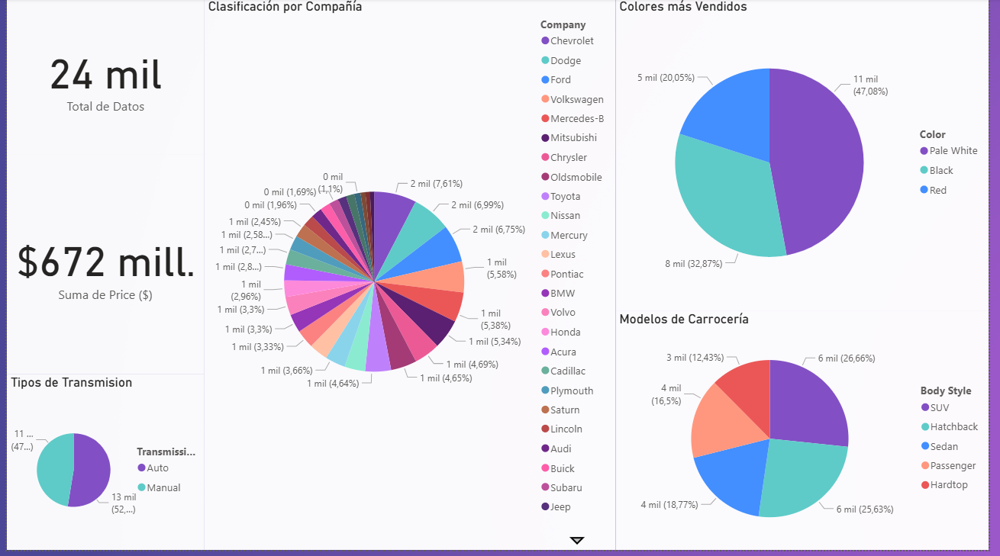

# English Version
# 🚗 Vehicle Sales Analysis

## 👤 Project Overview
This project involves a comprehensive analysis of a vehicle sales dataset. The primary objective is to explore sales behavior across various dimensions, such as manufacturer, color, transmission type, and body style, utilizing **Power BI** for advanced data visualization.

## 🛠️ Technical Stack
* **Visualization:** Power BI (Interactive Dashboards & Sales Metrics).
* **Data Processing:** Microsoft Excel (Preliminary data cleaning and formatting).
* **Dataset:** 24,000 records of vehicle sales transactions.

## 📈 Key Performance Indicators (KPIs)
* **Total Records:** 24,000 units.
* **Total Sales Volume:** $672 Million.
* **Sales Segmentation:** Market analysis by Company, Color, Transmission, and Body Style.

## 📸 Dashboard Preview

*(Note: Replace with your actual image path)*

## 🔍 Analysis Highlights
The dashboard provides an intuitive interface to filter and analyze:
* **Manufacturer Performance:** Identifying top-selling companies.
* **Consumer Preferences:** Distribution of most popular colors and body models.
* **Mechanical Trends:** Sales ratio between Automatic and Manual transmissions.

## 📂 Project Structure
* `/data`: Original CSV dataset.
* `/images`: Dashboard screenshots for quick preview.
* `Car Sales Analysis.pbix`: Power BI file for full interactive exploration.

---
**Developed by:** Carlos Antonio Bernal Benítez - *Systems Engineer*

# Version en Español
# 🚗 Análisis de Ventas de Vehículos

## 👤 Descripción del Proyecto
Este proyecto consiste en el análisis integral de una base de datos sobre ventas de vehículos. El objetivo principal es explorar el comportamiento de las ventas según compañía, color, tipo de transmisión y modelo de carrocería, utilizando **Power BI** para la visualización avanzada de datos.

## 🛠️ Stack Técnico
* **Visualización:** Power BI (Dashboards interactivos y métricas de ventas).
* **Procesamiento de Datos:** Microsoft Excel (Limpieza preliminar y formateo).
* **Dataset:** 24,000 registros de transacciones de venta.

## 📈 Indicadores Clave de Desempeño (KPIs)
* **Total de Registros:** 24,000 unidades.
* **Volumen Total de Ventas:** $672 Millones.
* **Segmentación de Ventas:** Análisis de mercado por Compañía, Color, Transmisión y Carrocería.

## 📸 Vista Previa del Dashboard

## 🔍 Aspectos Destacados del Análisis
El dashboard proporciona una interfaz intuitiva para filtrar y analizar:
* **Rendimiento por Fabricante:** Identificación de las compañías líderes en ventas.
* **Preferencias del Consumidor:** Distribución de los colores y modelos de carrocería más populares.
* **Tendencias Mecánicas:** Relación de ventas entre transmisiones Automáticas y Manuales.

## 📂 Estructura del Repositorio
* `/data`: Archivo CSV con los datos originales.
* `/images`: Capturas de pantalla del dashboard para vista previa rápida.
* `Car Sales Analysis.pbix`: Archivo de Power BI para exploración interactiva completa.

---
**Desarrollado por:** Carlos Antonio Bernal Benítez - *Ingeniero de Sistemas*
