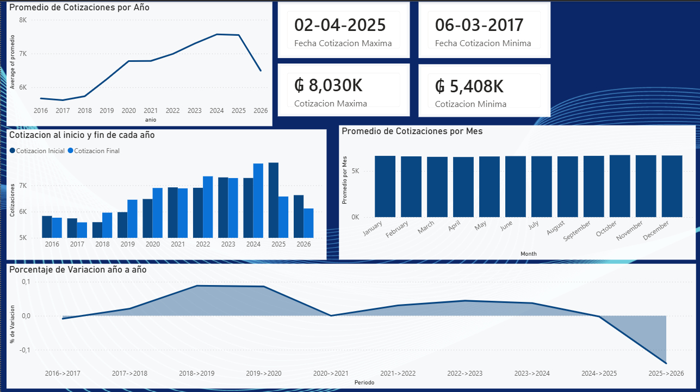

# Cotizaciones del Dólar Americano (USD/PYG) 2016-2026

**Autor:** Carlos Bernal  
**Herramientas:** Excel (Power Query) · MySQL · Power BI

---

## Descripción del proyecto

El proyecto analiza las cotizaciones diarias del dólar americano en Paraguay 
desde 2016 hasta 2026, incluyendo un pipeline completo desde la extracción 
de datos del BCP hasta la visualización en Power BI, pasando por limpieza 
en Power Query y análisis en MySQL.

El dashboard incluye:
- Promedio de cotizaciones por año y por mes
- Cotizaciones máxima y mínima en todo el histórico
- Comparación de cotizaciones al inicio y fin de cada año
- Porcentaje de variación año a año

---

## Fuente de datos

Banco Central del Paraguay (BCP)  
Planillas anuales de cotizaciones del dólar americano (USD/PYG)  
Período: 2016 - 2026  
Formato original: .xlsx  
Enlace: https://www.bcp.gov.py/webapps/web/cotizacion/monedas-historica

---

## Pipeline de datos

1. **Extracción** — Descarga manual de las planillas anuales del sitio del BCP
2. **Limpieza** — Unión y transformación de los archivos en Power Query (Excel)
3. **Almacenamiento** — Carga del dataset a MySQL para análisis con SQL
4. **Visualización** — Conexión a Power BI y construcción del dashboard

---

## Consultas SQL

### 1. Registros por año
```sql
SELECT YEAR(fecha) AS anio, COUNT(cotizacion) AS registros 
FROM cotizacion_dolar 
GROUP BY YEAR(fecha);
```

### 2. Cotización máxima y mínima histórica con fecha
```sql
SELECT cotizacion, fecha 
FROM cotizacion_dolar 
WHERE cotizacion = (SELECT MAX(cotizacion) FROM cotizacion_dolar)
OR cotizacion = (SELECT MIN(cotizacion) FROM cotizacion_dolar);
```

### 3. Promedio anual por año
```sql
SELECT YEAR(fecha) AS anio, ROUND(AVG(cotizacion),2) AS promedio 
FROM cotizacion_dolar
GROUP BY anio
ORDER BY anio;
```

### 4. Mes con promedio más alto y más bajo históricamente
```sql
(SELECT MONTHNAME(fecha) AS mes, ROUND(AVG(cotizacion),2) AS promedio 
 FROM cotizacion_dolar
 GROUP BY MONTH(fecha)
 ORDER BY promedio DESC LIMIT 1)
UNION ALL
(SELECT MONTHNAME(fecha) AS mes, ROUND(AVG(cotizacion),2) AS promedio 
 FROM cotizacion_dolar
 GROUP BY MONTH(fecha)
 ORDER BY promedio ASC LIMIT 1);
```

### 5. Año con mayor variación entre máximo y mínimo
```sql
SELECT YEAR(fecha), MAX(cotizacion) AS max, MIN(cotizacion) AS min, 
ROUND(MAX(cotizacion) - MIN(cotizacion),2) AS diferencia 
FROM cotizacion_dolar
GROUP BY YEAR(fecha)
ORDER BY diferencia DESC LIMIT 1;
```

### 6. Variación porcentual del promedio anual año a año
```sql
SELECT actual.anio AS anio_base, 
actual.promedio_anual AS promedio_base,
siguiente.anio AS anio_siguiente,
siguiente.promedio_anual AS promedio_siguiente,
ROUND((siguiente.promedio_anual - actual.promedio_anual)/actual.promedio_anual*100,2) AS porcentaje_variacion
FROM (SELECT YEAR(fecha) AS anio, ROUND(AVG(cotizacion),2) AS promedio_anual 
      FROM cotizacion_dolar GROUP BY YEAR(fecha)) AS actual
INNER JOIN (SELECT YEAR(fecha) AS anio, ROUND(AVG(cotizacion),2) AS promedio_anual 
            FROM cotizacion_dolar GROUP BY YEAR(fecha)) AS siguiente 
ON actual.anio = siguiente.anio - 1
ORDER BY actual.anio;
```

### 7. Cotización al primer y último día hábil de cada año
```sql
SELECT fechas.anio, fechas.primer_dia, c_inicio.cotizacion AS cotizacion_inicial,
fechas.ultimo_dia, c_fin.cotizacion AS cotizacion_final 
FROM (SELECT YEAR(fecha) AS anio, MIN(fecha) AS primer_dia, MAX(fecha) AS ultimo_dia 
      FROM cotizacion_dolar GROUP BY YEAR(fecha)) AS fechas
INNER JOIN cotizacion_dolar AS c_inicio ON fechas.primer_dia = c_inicio.fecha
INNER JOIN cotizacion_dolar AS c_fin ON fechas.ultimo_dia = c_fin.fecha;
```

### 8. Días por año con cotización sobre el promedio anual
```sql
SELECT Prom_anual.anio AS anio, COUNT(cotizacion_diaria.cotizacion) AS dias_sobre_promedio 
FROM (SELECT YEAR(fecha) AS anio, AVG(cotizacion) AS promedio_anual 
      FROM cotizacion_dolar GROUP BY anio) AS Prom_anual
LEFT JOIN (SELECT fecha, cotizacion FROM cotizacion_dolar) AS cotizacion_diaria
ON YEAR(cotizacion_diaria.fecha) = Prom_anual.anio 
AND cotizacion_diaria.cotizacion > Prom_anual.promedio_anual
GROUP BY Prom_anual.anio;
```

---

## Columnas calculadas y medidas DAX

### Columna calculada
**Periodo** — Etiqueta de periodo para el gráfico de variación anual
```dax
Periodo = [anio_base] & "->" & [anio_siguiente]
```

### Medidas DAX
**Fecha Cotizacion Maxima** — Fecha en que ocurrió la cotización máxima histórica
```dax
Fecha Cotizacion Maxima = 
FORMAT(
    CALCULATE(
        MAX('cotizacion_dolar'[fecha]),
        'cotizacion_dolar'[cotizacion] = MAX('cotizacion_dolar'[cotizacion])
    ), 
    "DD-MM-YYYY"
)
```

**Fecha Cotizacion Minima** — Fecha en que ocurrió la cotización mínima histórica
```dax
Fecha Cotizacion Minima = 
FORMAT(
    CALCULATE(
        MIN('cotizacion_dolar'[fecha]),
        'cotizacion_dolar'[cotizacion] = MIN('cotizacion_dolar'[cotizacion])
    ), 
    "DD-MM-YYYY"
)
```

---

## Visuales



- **Gráfico de línea** — Promedio de cotizaciones por año
- **Tarjetas KPI** — Cotización máxima y mínima histórica con su fecha
- **Gráfico de barras** — Cotización al inicio y fin de cada año
- **Gráfico de barras** — Promedio de cotizaciones por mes
- **Gráfico de área** — Porcentaje de variación año a año

---

## Conclusiones

El dólar americano mostró una tendencia alcista sostenida en Paraguay durante 
el período analizado, pasando de un promedio de 5.668 Gs en 2016 a un pico 
de 8.030 Gs en abril de 2025 — su valor máximo histórico en el dataset. 
Incluso en su punto más bajo (5.408 Gs en marzo de 2017) se mantuvo por 
encima de los 5.000 Gs, evidenciando estabilidad en el piso de la cotización.

A partir de 2020 se observa una aceleración en la suba, coincidiendo con el 
contexto económico global. El dólar se mantuvo por encima de los 6.000 Gs 
desde 2019 hasta la fecha del dataset. El pico se registró a finales de 2024 
e inicios de 2025, seguido de una caída notable hacia finales de ese año.

Los valores de 2026 muestran una baja pronunciada en el porcentaje de 
variación, lo cual se explica porque el dataset solo contiene datos hasta 
el 12 de mayo de 2026 al momento de su extracción.
